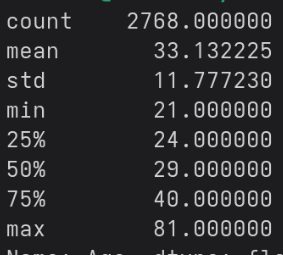
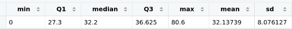

# Diabetes-Data-Analysis

A data analysis project designed to determine the effect of health problems and attributes of patients on whether or not they have diabetes

## Diabetes Overview

Diabetes is a health condition where blood sugar spikes due to insufficient insulin production (which is needed to allow glucose to enter cells) or the improper response of the body to insulin. Long-term consequences of diabetes include heart attack, stroke, nerve damage, and hearing loss. As these consequences can either be fatal or worsen quality of life, identifying patients at risk is critical for early diagnosis and treatment of these patients. Early treatment, in turn, greatly reduces the chance that diabetes evolves into the afformentioned long-term effects. This analysis project will contribute to early diabetes diagnosis and treatment by investigating the effect of various risk factors on whether or not a patient has diabetes.

## Dataset

- Healthcare Diabetes Dataset by Nandita Pore
    - Used for predicting if a patient is at risk of diabetes based on a list of risk factors
- Key Variables
    - Outcome: the main variable for my analysis, states if diabetes is present (1) or absent (0) in a patient
    - Blood pressure, diastolic (mmHg)
    - BMI (kg/m^2)
    - Age (years)

## Research Questions

1. Is diabetes more likely in older people?
2. Do high blood pressure and high BMI create a higher risk of diabetes?

## Descriptive Stats

### Age



According to these descriptive stats, there are 2768 entries in this dataset. The average age of people listed in this dataset is approximately 33 years old. The range of ages included is 21 to 81 years old. The standard deviation is 11 years, which is large in the context of age, so the data points are spread out, indicating high variability in the age data.

### BMI



The descriptive stats give both a mean and a median. To figure out which one to use, we must see if the data is skewed or has outliers by creating a histogram.


There is an insignificant difference between the distance from the minimum to the middle and the distance from the middle to the maximum. However, there is a clear outlier on the left side of the histogram, so it is more appropriate to use the median (32.2 BMI)

The range of BMIs is 0 to 80.6. The standard deviation is approximately 8.08 BMI. Any BMI below 18.4 indicates significantly low mass, so the standard deviation is very small in this context. Therefore, the data points are tightly clustered around the median, indicating high variability in the age data.

### Blood pressure


The range of blood pressures is 0 to 122 mmHg diastolic. The standard deviation is 19.23 mmHg diastolic. In the context of blood pressure categories, this could be considered as a significant jump. Starting from a low blood pressure of 59, adding 19 results in 78 mmHg diastolic, making the jump into the optimal category according to the Heart Research Institute. Adding on another 19 mmHg results in 97 mmHg, jumping to High Blood Pressure Stage 2 according to the NIH. So a standard deviation of 19.23 indicates that the data points are spread out and that there is high variability in the data.

The average blood pressure is 69.13 mmHg diastolic.

## Visualizations

## Hypothesis Testing

## Insights

## How to Run/See the Analysis Files

### Python

Go to the python directory, choose either desc.py or ttest.py to run, and run this command

```bash
python3 [desc.py or ttest.py]
```

### R

Copy and paste the contents of either desc.r or ttest.r. Visit [Posit Cloud](posit.cloud) and make a new project. Then add a new R file, paste your code, save the file and run it. Be sure to also paste the CSV file into a new text file and save it as a CSV.

### SAS

Create a SAS account, then open SAS OnDemand for Academics. Paste the SAS code into a SAS file. Right-click on Files (Home), click Upload Files, then import the CSV file. Then, run the SAS file.

### Tableau Dashboard

Link TBD

## Log of Issues
```diff
- Problem: The entire dataset got forced into one row of the 2D array 
+ Solution: Use row = [file].readline(), not row = [file].readlines()

- Problem: When the CSV file is read, every other line is skipped
+ Solution: Make the for loop header as for row in range(1,[number of rows]) to include everything instead of using for row in [file name]
`
- Problem: When printing array[x][y], only one character is printed
+ Solution: Since Python interprets each row of the CSV as a string, add .split(",") onto the end to make each row a list of values 

- Problem: I used pop(1) to remove the first row, but the first row is unchanged
+ Solution: Indexing starts at 0, so use pop(0)

- Problem: I initially set diabetes_status to the last element in a row of the 2D array, then I split diabetes_status using the junk character \n as the delimiter, then I reassigned diabetes_status to the first element of the split array (aka the clean value), but this change is not shown when I print out the entire 2D array
+ Solution: When you reassigned diabetes_status, it became disassociated from the row's last element and therefore disassociated from the entire 2D array. You need to reassign the new diabetes_status to the row's last element.

- Problem, 7/30/26: When I look at the subset CSV files, I find that bmi_status and the last row of data are cut out completely
+ Solution: You subtracted 1 from the row length and column length, which cutoff the nested loop before it could reach the last column and row. Putting only one number in range() means it by default starts at 0 (the first list index) and ends one before the specified number (in this case, the length of the row/column minus one, which is perfectly in range, hence why the extra subtraction from the length was not needed)

```

## Sources/Tools Used

1. Dataset link: https://www.kaggle.com/datasets/nanditapore/healthcare-diabetes
2. The Markdown Guide: https://www.markdownguide.org/
3. Diabetes overview: https://my.clevelandclinic.org/health/diseases/7104-diabetes
4. Coding assistants: 
- Claude: https://claude.ai
- Gemma: https://developers.google.com/edge/gallery
5. pandas: https://pandas.pydata.org/
6. R list object to type double: https://stackoverflow.com/questions/12384071/how-to-coerce-a-list-object-to-type-double
7. When to use mean and median: https://www.statology.org/when-to-use-mean-vs-median/
8. ggplot2: https://ggplot2.tidyverse.org/index.html
9. "Learning SAS in the Computer Lab" (3rd Edition) by Elliott and Morrell
10. SAS CSV import: https://youtu.be/d7Xnvkn0D9I?si=2t-y-YDDQt60PFOb
11. SAS Descriptive Stats: https://research.library.gsu.edu/c.php?g=925001&p=7660893
12. BP ranges: https://www.nhlbi.nih.gov/health/high-blood-pressure
13. More BP ranges: https://www.hri.org.au/health/learn/risk-factors/what-is-normal-blood-pressure-by-age
14. w3Schools Python: https://www.w3schools.com/python/default.asp
15. w3Schools SQL: https://www.w3schools.com/sql/default.asp
16. w3Schools Python sqlite3 module: https://www.w3schools.com/python/ref_module_sqlite3.asp
17. python sqlite3 module docs: https://docs.python.org/3/library/sqlite3.html
