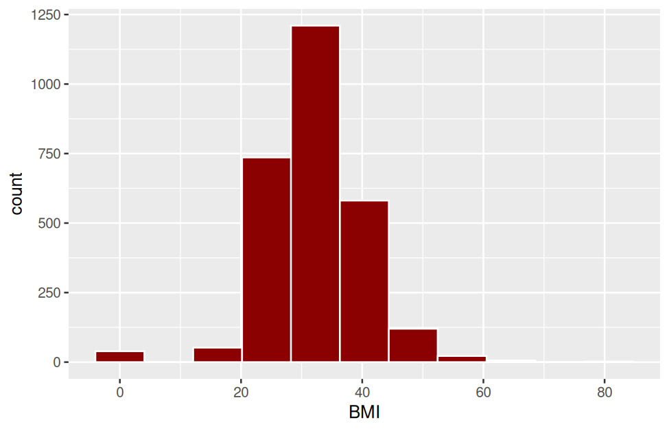
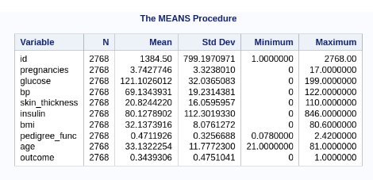
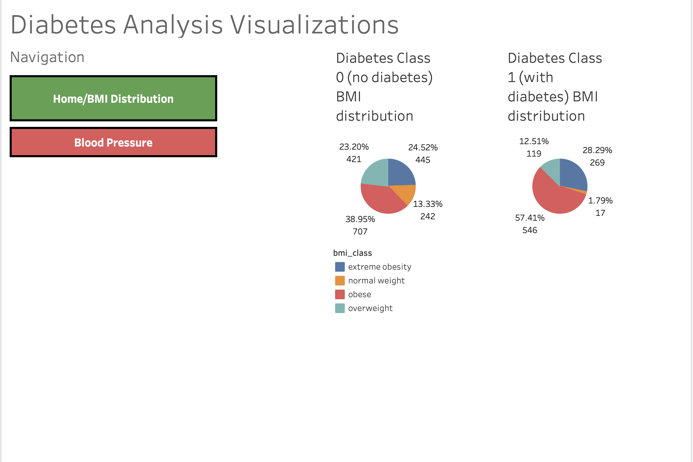
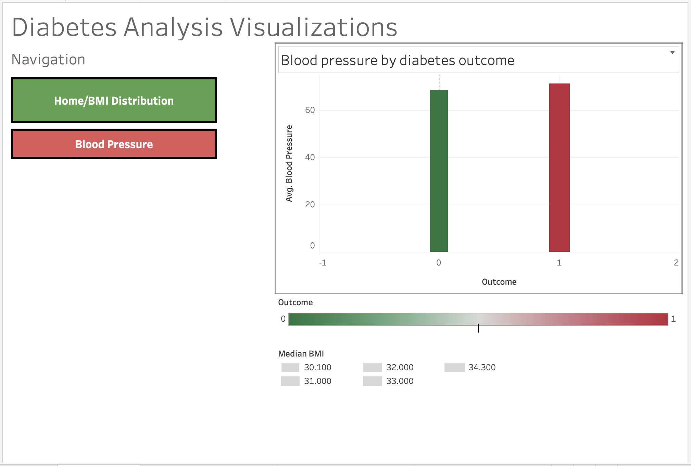
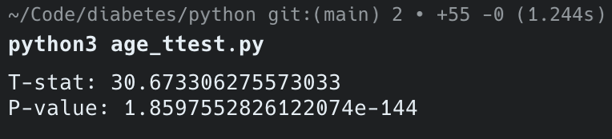
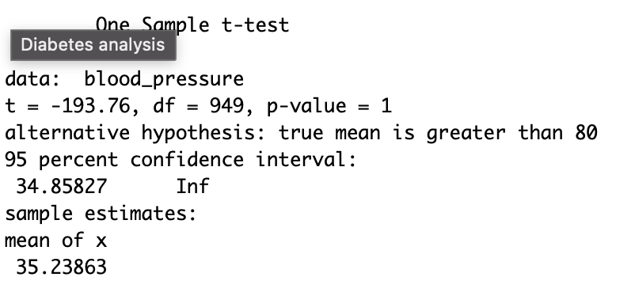
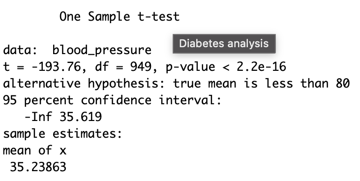
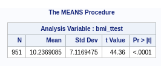
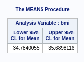

# Diabetes-Data-Analysis

A data analysis project designed to determine the effect of health problems and attributes of patients on whether or not they have diabetes

## Diabetes Overview

Diabetes is a health condition where blood sugar spikes due to insufficient insulin production (which is needed to allow glucose to enter cells) or the improper response of the body to insulin. Long-term consequences of diabetes include heart attack, stroke, nerve damage, and hearing loss. As these consequences can either be fatal or worsen quality of life, identifying patients at risk is critical for early diagnosis and treatment of these patients. Early treatment, in turn, greatly reduces the chance that diabetes evolves into the aformentioned long-term effects. This analysis project will contribute to early diabetes diagnosis and treatment by investigating the effect of various risk factors on whether or not a patient has diabetes.

## Dataset

- Healthcare Diabetes Dataset by Nandita Pore
    - Used for predicting if a patient is at risk of diabetes based on a list of risk factors
- Key Variables
    - Outcome: the main variable for my analysis, states if diabetes is present (1) or absent (0) in a patient
    - Blood pressure, diastolic (mmHg)
    - BMI (kg/m^2)
    - Age (years)

## Research Questions

1. Is diabetes more likely in older people?
2. Do high blood pressure and high BMI create a higher risk of diabetes?

## Descriptive Stats

### Age


According to these descriptive stats, there are 2768 entries in this dataset. The average age of people listed in this dataset is approximately 33 years old. The range of ages included is 21 to 81 years old. The standard deviation is 11 years, which is large in the context of age, so the data points are spread out, indicating high variability in the age data.

### BMI


The descriptive stats give both a mean and a median. To figure out which one to use, we must see if the data is skewed or has outliers by creating a histogram.



There is an insignificant difference between the distance from the minimum to the middle and the distance from the middle to the maximum. However, there is a clear outlier on the left side of the histogram, so it is more appropriate to use the median (32.2 BMI)

The range of BMIs is 0 to 80.6. The standard deviation is approximately 8.08 BMI. Any BMI below 18.4 indicates significantly low mass, so the standard deviation is very small in this context. Therefore, the data points are tightly clustered around the median, indicating high variability in the age data.

### Blood pressure



The range of blood pressures is 0 to 122 mmHg diastolic. The standard deviation is 19.23 mmHg diastolic. In the context of blood pressure categories, this could be considered as a significant jump. Starting from a low blood pressure of 59, adding 19 results in 78 mmHg diastolic, making the jump into the optimal category according to the Heart Research Institute. Adding on another 19 mmHg results in 97 mmHg, jumping to High Blood Pressure Stage 2 according to the NIH. So a standard deviation of 19.23 indicates that the data points are spread out and that there is high variability in the data.

The average blood pressure is 69.13 mmHg diastolic.

## Visualizations

### BMI Class Distribution



Across both diabetes outcome classes, the majority of patients are considered overweight and above, while a small minority of patients are considered to be at normal weight. The reason for this could be that all patients recorded in this dataset are stuck in unhealthy habits. However, the clear difference between the two diabetes outcome groups is the proportions. Specifically, there are significantly fewer patients with normal weight in the group of patients with diabetes (class 1) than in the group of patients without diabetes (class 0), showing how diabetes and high BMI are strongly associated with each other.

### Blood Pressure



According to this bar chart and the tooltips shown in the dashboard (not depicted in this image), the average blood pressure of patients without diabetes is 68.119 mmHg diastolic, and the average blood pressure of patients with diabetes is 71.070 mmHg diastolic. The blood pressures of the two diabetes outcome groups are close together likely due to the unhealthy habits of all patients in this dataset. But on average, the patients with diabetes have higher blood pressures than patients without diabetes (a difference of 2.951 mmHg diastolic in favor of patients with diabetes), implying the strong association of high blood pressure and diabetes. 

## Hypothesis Testing

All these tests are one-tail t-tests using the diabetes class 1 subset (patients with diabetes)

If p > 0.05, fail to reject null
If p < 0.05, reject null

### Test 1: Is diabetes more prevalent in older people? (age and diabetes outcome)

H0 (null hypothesis): Average age = 50 years
Ha (alt hypothesis): Average age > 50 years



According to the t-test results, the p-value is 1.8597552826122074e-144, which is significantly smaller than 0.05, so we can reject the null hypothesis that the average age of the patients with diabetes is equal to 50 years. Therefore, the average age of the diabetes patients is greater than 50 years, implying the correlation between old age and diabetes.

### Test 2: Does high blood pressure create a higher risk of diabetes?

H0: average blood pressure = 80 mmHg diastolic (threshold for high blood pressure, according to the NIH)
Ha: average blood pressure > 80 mmHg diastolic



According to the t-test results, the p-value is 1, which is larger than 0.05, so we fail to reject the null hypothesis that the average blood pressure is 80 mmHg in these diabetes patients, so on average, the diabetes patients don't have incredibly severe hypertension. However, there are still two possibilities left: 

1. on average, the diabetes patients have mildly high blood pressure
2. on average, the diabetes patients have either normal or elevated blood pressure

To figure out which scenario is prevalent, another t-test is needed:

H0: average blood pressure = 80 mmHg diastolic
Ha: average blood pressure < 80 mmHg diastolic



According to this second t-test, the p-value is less than 2.2e-16, which is significantly smaller than 0.05, so we reject the null hypothesis that the average blood pressure is equal to 80 mmHg diastolic for these diabetes patients. This means that these patients have either normal or elevated blood pressure, which either means that high blood pressure is not a major factor for diabetes or reveals a critical anomaly in this dataset.

### Test 3: Does high BMI create a higher risk of diabetes?

H0: average BMI = 25 (minimum BMI to be considered overweight)
Ha: average BMI > 25



According to this t-test, the p-value is less than .0001, which is significantly smaller than 0.05, so we reject the null hypothesis thatthe average BMI is equal to 25 for these diabetes patients. This leaves two possibilities:

1. The average BMI of the diabetes patients is greater than 25 (overweight, obese, extremely obese)
2. The average BMI of the diabetes patients is less than 25 (normal weight)

We can find out which scenario prevails using confidence intervals



From these results, we are 95% confident that the true average BMI is between 34.78 and 35.69 when rounding to 2 decimal place. This range is greater than a BMI of 25. Therefore, on average, the diabetes patients are overweight, obese, or extremely obese, implying that a high BMI does create a higher risk of diabetes.

## Summary of Insights

1. High BMI does create a higher risk of diabetes, given that less diabetes patients have a healthy weight according to the BMI pie charts and confidence intervals

2. The relationship of high (diastolic) blood pressure and diabetes risk is not very strong. The bar chart showed that the average blood pressure of the diabetes patients in this dataset is only slightly higher than the average blood pressure of patients without diabetes, and the t-test asserted that on average, the diabetes patients have only normal/elevated diastolic blood pressure. This could be due to 3 factors
    1. Only diastolic blood pressure was available in this dataset, and a further study into diabetes patients and systolic blood pressure may show different results
    2. The patients with diabetes and the patients without diabetes are all likely living unhealthy lifestyles, making the differences in blood pressure insignificant
    3. There could be an undectected anomaly in this dataset

3. According to the age t-test, the average age of diabetes patients is greater than 50 years, implying that diabetes is more prevalent in older people 

## How to Run/See the Analysis Files

### Python

Go to the python directory, choose either desc.py or ttest.py to run, and run this command

```bash
python3 [desc.py or ttest.py]
```

### R

Copy and paste the contents of either desc.r or ttest.r. Visit [Posit Cloud](posit.cloud) and make a new project. Then add a new R file, paste your code, save the file and run it. Be sure to also paste the CSV file into a new text file and save it as a CSV.

### SAS

Create a SAS account, then open SAS OnDemand for Academics. Paste the SAS code into a SAS file. Right-click on Files (Home), click Upload Files, then import the CSV file. Then, run the SAS file.

### Tableau Dashboard

https://public.tableau.com/views/DiabetesAnalysis_17858119015890/Dashboard1?:language=en-US&:sid=&:redirect=auth&:display_count=n&:origin=viz_share_link

## Log of Issues
```diff
- Problem: The entire dataset got forced into one row of the 2D array 
+ Solution: Use row = [file].readline(), not row = [file].readlines()

- Problem: When the CSV file is read, every other line is skipped
+ Solution: Make the for loop header as for row in range(1,[number of rows]) to include everything instead of using for row in [file name]
`
- Problem: When printing array[x][y], only one character is printed
+ Solution: Since Python interprets each row of the CSV as a string, add .split(",") onto the end to make each row a list of values 

- Problem: I used pop(1) to remove the first row, but the first row is unchanged
+ Solution: Indexing starts at 0, so use pop(0)

- Problem: I initially set diabetes_status to the last element in a row of the 2D array, then I split diabetes_status using the junk character \n as the delimiter, then I reassigned diabetes_status to the first element of the split array (aka the clean value), but this change is not shown when I print out the entire 2D array
+ Solution: When you reassigned diabetes_status, it became disassociated from the row's last element and therefore disassociated from the entire 2D array. You need to reassign the new diabetes_status to the row's last element.

- Problem, 7/30/26: When I look at the subset CSV files, I find that bmi_status and the last row of data are cut out completely
+ Solution: You subtracted 1 from the row length and column length, which cutoff the nested loop before it could reach the last column and row. Putting only one number in range() means it by default starts at 0 (the first list index) and ends one before the specified number (in this case, the length of the row/column minus one, which is perfectly in range, hence why the extra subtraction from the length was not needed)

- Problem, 8/4/26: When I try to extract a column from a 2D array, it returns single numbers instead of the entire number
+ Solution: Python interprets each split line as a string since you reassigned the split line back into the line variable. Add each split line to a different list
```

## Sources/Tools Used

1. Dataset link: https://www.kaggle.com/datasets/nanditapore/healthcare-diabetes
2. The Markdown Guide: https://www.markdownguide.org/
3. Diabetes overview: https://my.clevelandclinic.org/health/diseases/7104-diabetes
4. Coding assistants: 
- Claude: https://claude.ai
- Gemma: https://developers.google.com/edge/gallery
5. pandas: https://pandas.pydata.org/
6. R list object to type double: https://stackoverflow.com/questions/12384071/how-to-coerce-a-list-object-to-type-double
7. When to use mean and median: https://www.statology.org/when-to-use-mean-vs-median/
8. ggplot2: https://ggplot2.tidyverse.org/index.html
9. "Learning SAS in the Computer Lab" (3rd Edition) by Elliott and Morrell
10. SAS CSV import: https://youtu.be/d7Xnvkn0D9I?si=2t-y-YDDQt60PFOb
11. SAS Descriptive Stats: https://research.library.gsu.edu/c.php?g=925001&p=7660893
12. BP ranges: https://www.nhlbi.nih.gov/health/high-blood-pressure
13. More BP ranges: https://www.hri.org.au/health/learn/risk-factors/what-is-normal-blood-pressure-by-age
14. w3Schools Python: https://www.w3schools.com/python/default.asp
15. w3Schools SQL: https://www.w3schools.com/sql/default.asp
16. w3Schools Python sqlite3 module: https://www.w3schools.com/python/ref_module_sqlite3.asp
17. python sqlite3 module docs: https://docs.python.org/3/library/sqlite3.html
18. SciPy ttest: https://www.datacamp.com/tutorial/an-introduction-to-python-t-tests
19. NumPy array conversion: https://numpy.org/doc/stable/user/basics.creation.html
20. SciPy ttest_1samp() parameters: https://docs.scipy.org/doc/scipy/reference/generated/scipy.stats.ttest_1samp.html#scipy.stats.ttest_1samp
21. R t.test() - https://www.datacamp.com/tutorial/t-tests-r-tutorial
22. SAS tutorial: https://www.tutorialspoint.com/sas/index.htm
23. Benchmark for overweight classification: https://www.nhlbi.nih.gov/sites/default/files/media/docs/bmi_tbl.pdf
24. SAS confidence intervals using PROC MEANS: https://support.sas.com/documentation/cdl/en/proc/61895/HTML/default/viewer.htm#a002473542.htm
